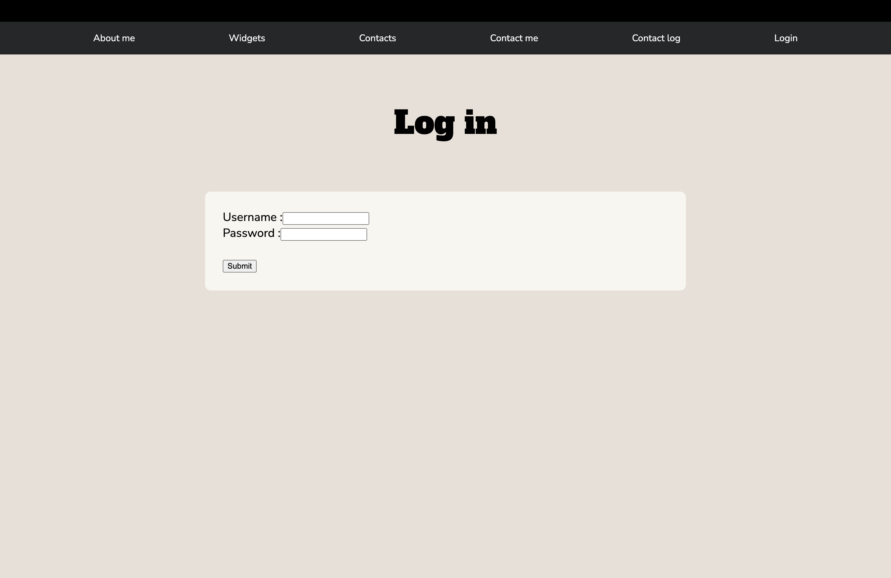
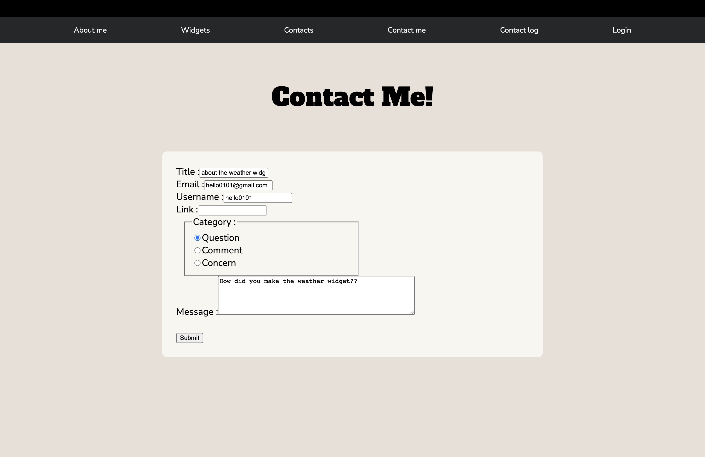
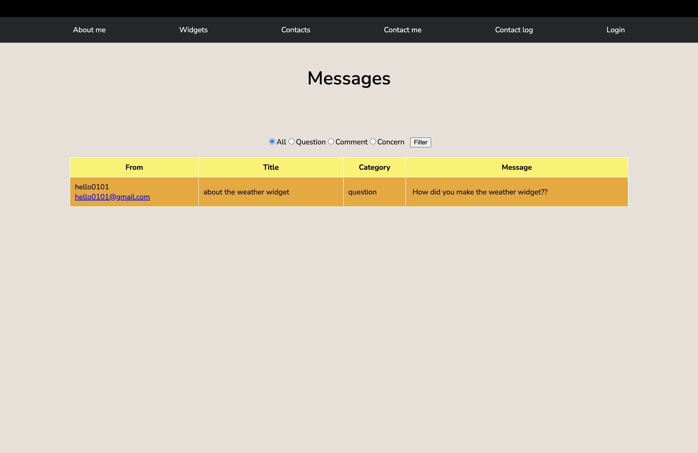
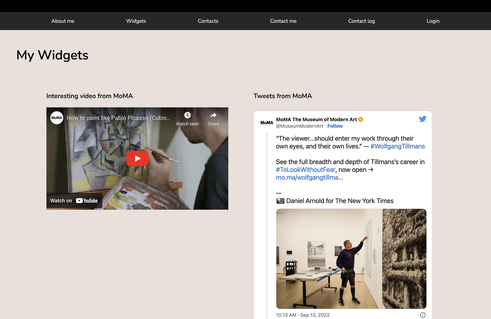
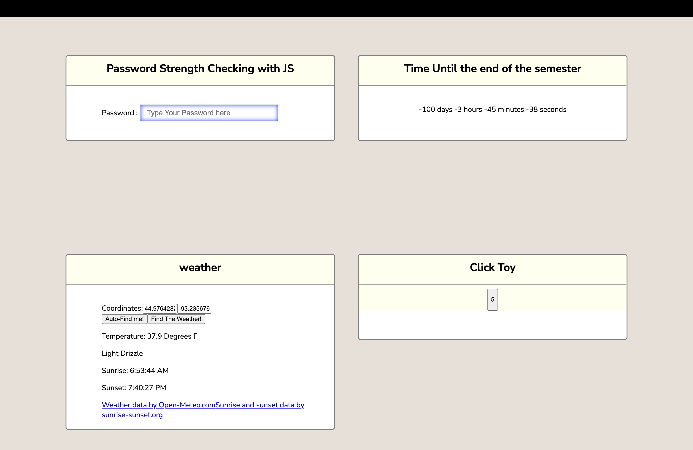
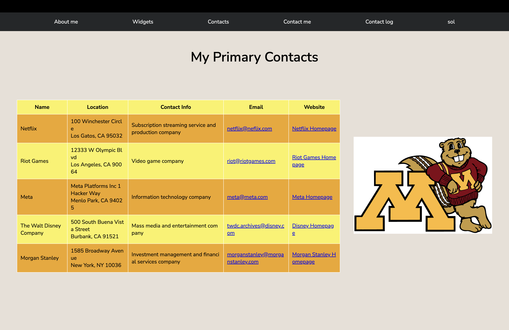
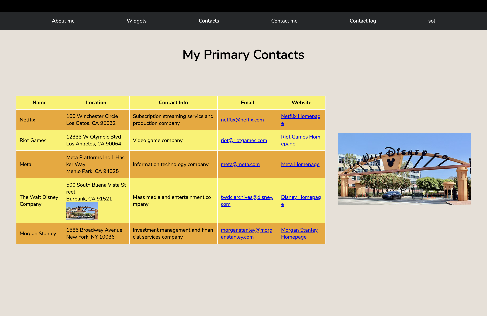

## Interactive website

## About the project

This is a full-stack web application with multiple features such as log-in, weather widget, D-day counter, contact me, and managing contact log.

### Key features:
* Login and Click Toy using express-session
* Submit Contact Me form and save submitted form in mySQL database
* Manage submitted Contact Me forms
* Weather widget
* Check the strength of a password based on certain requirements
* D-day counter







(Widgets on My widgets page)<br />


(Giving effects when locate your mouse on a specific contact information)<br />

## Technologies

* Built with Node.js, Express, SQL(MySQL), Javascript, CSS, and Pug

## Run the project

### you can run the project on your computer by following steps:

Clone the repository

```
git clone https://github.com/solswe/interactive-website.git
```

Set up your environment
```
npm install express
npm install express-session
npm install pug
npm install mysql
node server.js
```
Webpack will start the program automatically in your browser. If not, you can run it at http://localhost:9090 on your web browser. 